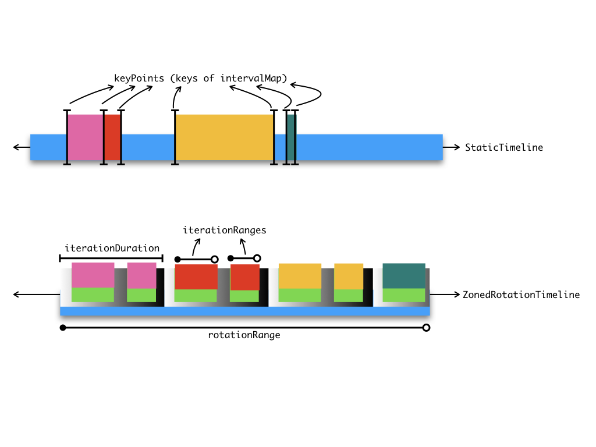

# timeline

Tiny Java library to calculate on-call timelines.

Written in pure Java using zero runtime dependency.

## Dependencies

| Dependency Scope    | Dependencies    |
| ------------------- | --------------- |
| runtime             | (only jdk-8)    |
| compile (provided)  | lombok          |
| test                | junit5          |

## Design

`Range` is a pair of `Comparable` values (start & end points).
This is the simplest data structure in the library.

`Timeline` is the base interface. It has only one method.

`StaticTimeline` is a finite segment of `Comparable` values which allows
to associate its arbitrary sub-segments (`Interval`s) with a list of
arbitrary values. The implementation utilises `NavigableMap` as
'interval map' (consider as another representation of 'interval tree').
`StaticTimeline` is the most important and most complex data structure
in the library. Actually, it has 150+ lines of code which is not
so complex tough.

`UnionTimeline` is a union of contained timelines, as the name suggests.

`PatchedTimeline` is a timeline which adds patch support on top of a
base timeline. Patch support is the ability to add, remove, or change
associated values in any part of the timeline.

`ZonedRotationTimeline` represents periodically recurring intervals of a
fixed duration, and assigns the given list of recipients to iterations
one-by-one . This is the only class mentioning `java.time` package.
Unlike previous ones which leaves time point type `C` as generic, this
implementation hard-codes the time point type as `ZonedDateTime`.

## TODO

- Write more granular unit tests
- Make a release
